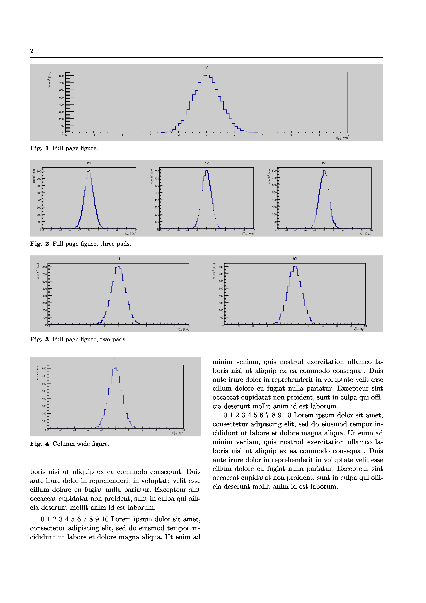
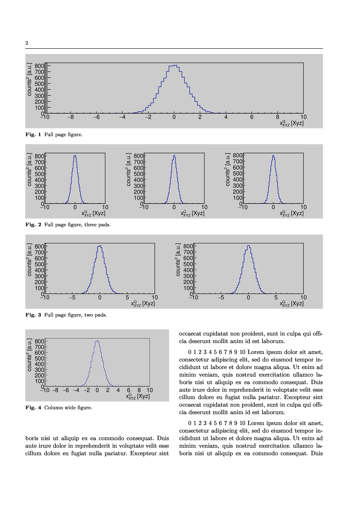

[](LICENSE) [](https://github.com/rlalik/canu/actions/workflows/ci.yml) [](https://isocpp.org/)

# CANU – Canvas UNIfier for ROOT

**CANU** (CANvas UNIfier) is a lightweight **C++17 header-only library** utility for the **ROOT** framework that helps produce **publication‑ready, consistently formatted plots**. It solves common issues in ROOT graphics related to canvas sizes, font scaling, axis formatting, margins, and legend placement.

> Designed for high‑energy physics analysis and journal publication workflows (e.g. EPJC, PRC, NIM, etc.).

It will transform your paper into a polished, consistently professional piece of writing.:

| None-formatted output  | CANU-formatted plots |
| ---------------------- | ---------------------- |
|  |  |

---

## 📌 Features

- 📐 **Canvas sizing tools**  
  Resize canvases to true physical sizes with consistent aspect ratio.

- 🔠 **Font & axis formatting**  
  Uniform font sizes in points, axis division/offset control.

- 📊 **Legend utilities**  
  Automatic placement and sizing of `TLegend` boxes.

- 📏 **Margins & layout helpers**  
  Normalization of margins with reference to page width.

- 🧰 **Journal presets**  
  Ready‑to‑use formatting for EPJC, NIM, PRC.

---

## 🚀 Quick Start

### Requirements

- ROOT (≥ 6.x)
- C++17 compiler

### Installation

CANU is **header‑only** — just include the header in your project:

```c++
#include "canu/canu.hpp"
```

And compile with:

```bash
g++ my_analysis.cpp $(root-config --cflags --libs)
```

or add to your cmake 

```cmake
find_package(canu REQUIRED)

target_link_libraries(project_exe PRIVATE canu::canu)
```

## 🧠 Basic Usage
### Create a CANU formatter

There are built‑in presets for common publication formats:

```c++
auto canu = cu::make_epjc_paper();
```

Resize a ROOT canvas

```c++
TCanvas c("c", "Plot", 800, 600);

hist->Draw();

canu.make_page_wide(&c);
c.SaveAs("figure.pdf");
```

This resizes the canvas to page width, applies fonts and margins.

---

## 🧰 API Reference

### Canvas Sizing

| Method | Description |
|--------|-------------|
| `resize_canvas(can, w, h)` | Resize to arbitrary width/height |
| `make_page_wide(can)` | Resize to page width |
| `make_column_wide(can)` | Resize to standard column width |

### Axis Properties

| Method | Description |
|--------|-------------|
| `set_max_digits(n)` | Maximum number of digits on axis |
| `set_ndivisions(n)` | Number of axis divisions |
| `set_title_offset(f)` | Title offset |
| `set_label_offset(f)` | Label offset |

### Legends

| Method | Description |
|--------|-------------|
| `place_legend(x, y, rows, cols, width)` | Creates a `TLegend` |
| `format_legend(can)` | Formats all legends in canvas |

---

## 🧪 Examples

### Formatting Existing ROOT Macros

Prepare macros to make page (`_canu_2d_page.C`):
```c++
#include "canu.hpp"

void _canu_2d_page(const char * macro_name)
{
    gStyle->SetPalette(kBird);

    auto canu = cu::make_nim_paper();
    canu.set_details_scale(2);

    gROOT->ProcessLine(Form(".x %s", macro_name));

    canu.make_page_wide(gPad->GetCanvas());
    canu.format_legend(gPad->GetCanvas());

    TString fname = macro_name;
    fname.ReplaceAll(".C", "");

    gPad->SaveAs(Form("out/%s.pdf", basename(fname.Data())));
    gPad->SaveAs(Form("out/%s.png", basename(fname.Data())));
    gPad->SaveAs(Form("out/%s.C", basename(fname.Data())));
}
```
and column-wide formatter (`_canu_2d_column.C`):
```c++
#include "canu.hpp"

void _canu_2d_column(const char * macro_name)
{
    gStyle->SetPalette(kBird);

    auto canu = cu::make_nim_paper();
    canu.set_details_scale(2);

    gROOT->ProcessLine(Form(".x %s", macro_name));

    canu.make_column_wide(gPad->GetCanvas());
    canu.format_legend(gPad->GetCanvas());

    TString fname = macro_name;
    fname.ReplaceAll(".C", "");

    gPad->SaveAs(Form("out/%s.pdf", basename(fname.Data())));
    gPad->SaveAs(Form("out/%s.png", basename(fname.Data())));
    gPad->SaveAs(Form("out/%s.C", basename(fname.Data())));
}
```
(these two differ by `make_page_wide` and `make_column_wide` only).

Prepare wrapper scripts: `wrapper_canu_page.sh`
```bash
#!/bin/bash

mkdir -p out
for f in $@; do
    root -l _canu_2d_page.C\(\"$f\"\) -q -b
done
```
and `wrapper_canu_column.sh`
```bash
#!/bin/bash

mkdir -p out
for f in $@; do
    root -l _canu_2d_column.C\(\"$f\"\) -q -b
done
```

Now, all your plots supposed for page-wide display format with:
```bash
./wrapper_canu_page.sh plot1.C plot2.C
```
and for column-wide plots:
```bash
./wrapper_canu_column.sh plot3.C plot4.C
```
See `example/` directory for working examples. Use `make` or `build_examples.sh`. Example can be used as a base for your paper workflow.

### Histogram Formatting

```c++
void plot1() {
    TH1F h(\"h\",\"Example\",100,-3,3);
    h.FillRandom(\"gaus\",10000);

    TCanvas c(\"c\",\"c\",800,600);
    h.Draw();

    auto canu = cu::make_epjc_paper();
    canu.make_column_wide(&c);

    c.SaveAs(\"hist_column.pdf\");
}
```

### Overlay with Axis Control

```c++
void plot_overlay() {
    TH1F h1(\"h1\",\"Data\",100,-5,5);
    TH1F h2(\"h2\",\"Model\",100,-5,5);

    h1.SetLineColor(kBlue);
    h2.SetLineColor(kRed);

    TCanvas c(\"c\",\"Overlay\",800,600);
    h1.Draw();
    h2.Draw(\"same\");

    auto canu = cu::make_prc_paper();
    canu.x_prop().set_ndivisions(510);
    canu.y_prop().set_ndivisions(505);

    canu.make_page_wide(&c);

    c.SaveAs(\"overlay_prc.pdf\");
}
```

---

## ⚠️ Common ROOT Pitfalls Solved by CANU

- Batch mode window/canvas size inconsistencies  
- Incorrect font scaling in points  
- Inconsistent margins across different canvases  
- Axis label offsets and legend sizing issues  

---

## 📦 Journal Presets

```c++
auto epjc = cu::make_epjc_paper();
auto nim  = cu::make_nim_paper();
auto prc  = cu::make_prc_paper();
```

To request other journals, create [new issue](https://github.com/rlalik/canu/issues/new) or submit new Pull request. See example how to prepare new journal definition.

---

## Building and installing

See the [BUILDING](BUILDING.md) document.

## 🧑‍💻 Contributing

See the [CONTRIBUTING](CONTRIBUTING.md) document. Pull requests are welcome.

---

## 📄 License

GPL-3.0 — see `LICENSE`.